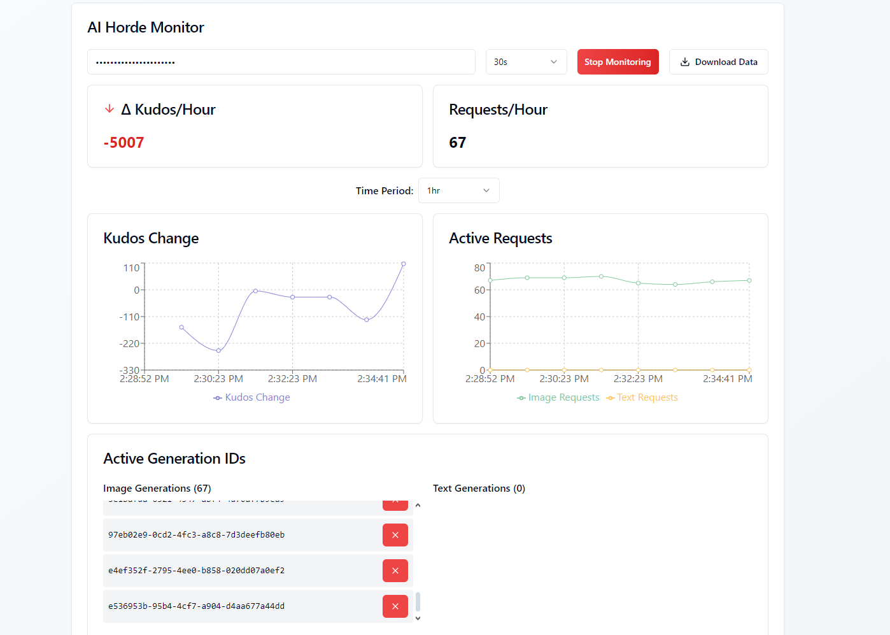
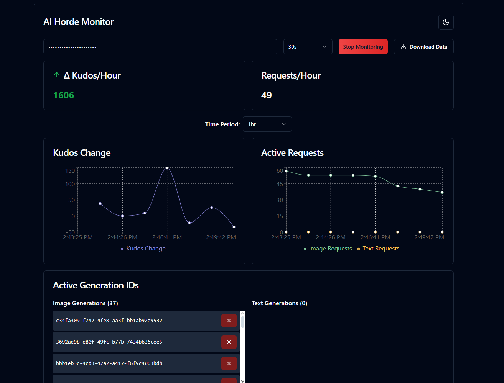

# AI Horde Monitor

A real-time monitoring dashboard for tracking your AI Horde kudos, requests, and generations. This web application provides visual insights into your AI Horde activity and helps you track your kudos economy over time.

## Features

- **Real-time Monitoring**: Track kudos balance and active generations
- **Generation Management**: Monitor and cancel ongoing generations
- **Data Export**: Download monitoring data as CSV
- **Dark/Light Theme Toggle**

## Installation

```bash
# Clone the repository
git clone https://github.com/MangoLion/aihorde-monitor.git
cd aihorde-monitor

# Install dependencies
npm install

# Start the development server
npm run dev
```

## Getting Started
2. Enter your AI Horde API key (main key, not shared key)
3. Select your desired polling interval
4. Click "Start Monitoring"

## Privacy

The application runs entirely in your browser and makes direct API calls to AI Horde. No data is stored on any external servers, and your API key is never transmitted anywhere except to AI Horde's API endpoints.

## Screenshots

### Main Interface


### Generation Details


### Dark Mode

